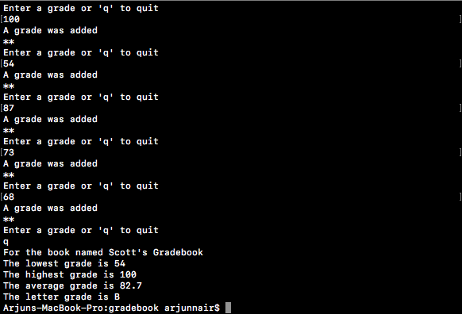

# Gradebook

A gradebook application I made thru C#. This is pure backend; this project was only created to help learn and practice C#. 

## How it works

You enter the number grades the student has recieved. If the number is nonvalid, it'll tell you it was invalid and to try again. Once you finish, type "q" to exit. Once you exit, it'll give you the lowest and highest number grades.  At the end, it'll give you an average number grade for all your grades and give you a letter grade. 

### To Do
Turn this into a real application using ASP.NET.
